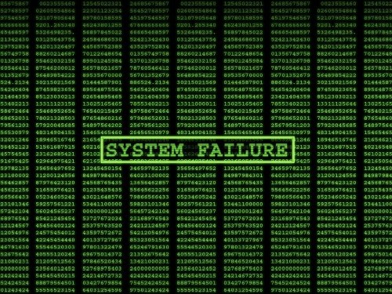
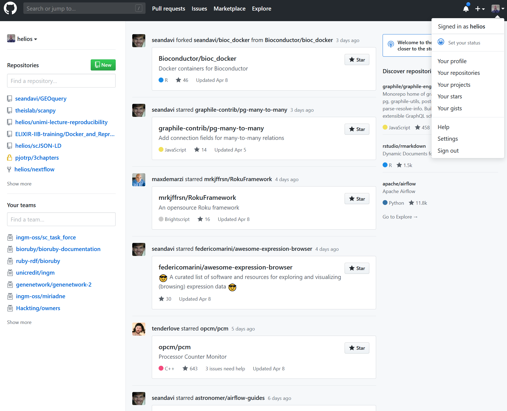
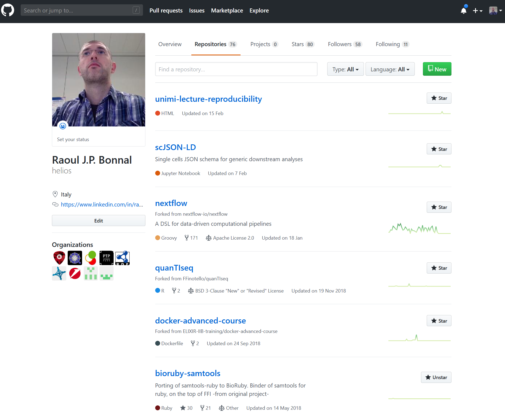
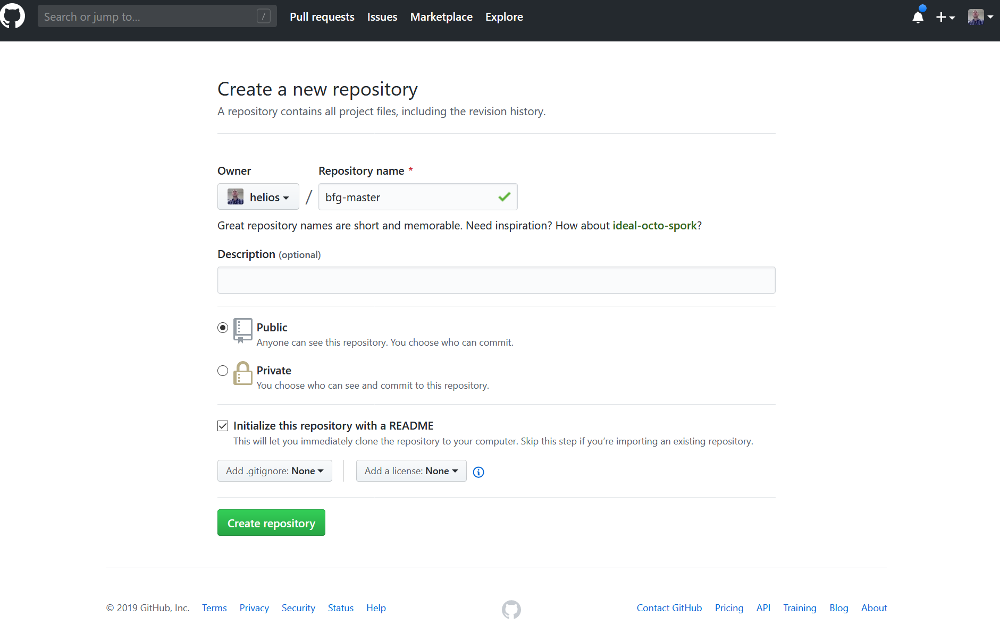
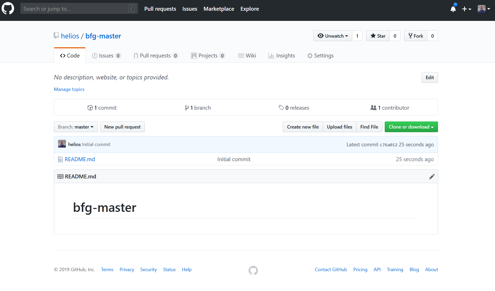
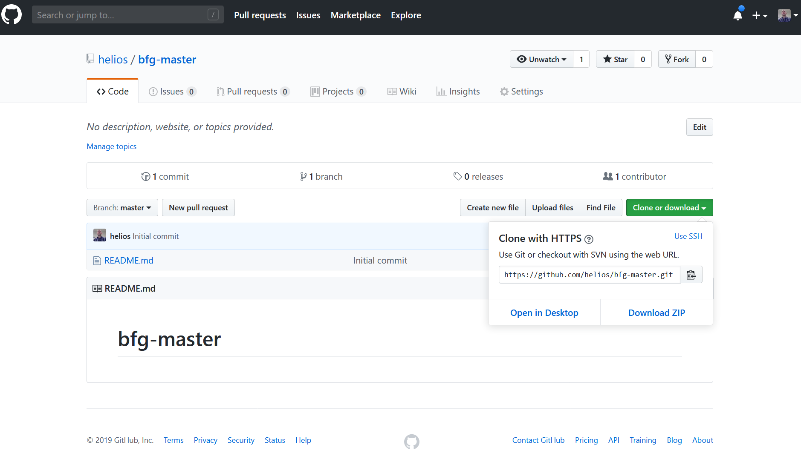
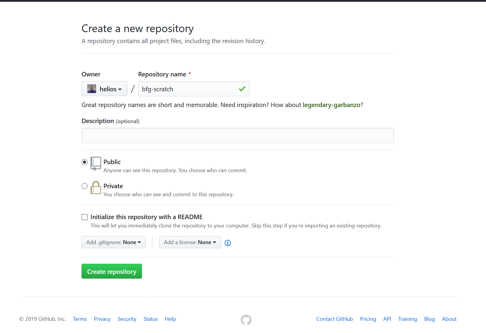
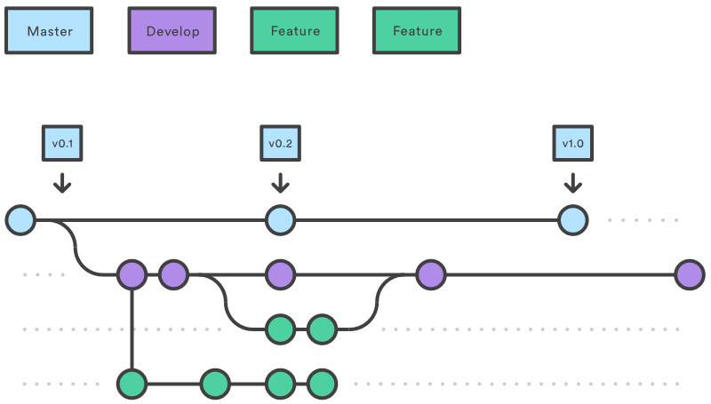

% Code Versioning
% Raoul J.P. Bonnal
% 2023-03-31

# Sharing Code

## Sharing Code
Many people want to contribute but modifying the same source code can be a mess.


## Who wrote what ?
Carl: "Hey John, did you modified the `split` function ?"

. . .

John: "No.

---

Carl: "Do you know who was working on that `split` function ?"

---

John: "I know that Jane was working on a new function for splitting our datasets."

## Who deleted my code ?
Jane: "Hey guys yesterday I wrote about 300 lines of code and today everything is wiped out. Do you have any clue about that ?"

Mike: "I am not sure but the IT during the night restored the whole storage beucase of a bug in the backup procedure. Try ask them."

---

Jane knocks to the IT office.

. . .

Jane: "I know that yesterday you restored the whole storage system. Can you recover my yesterday's work ? I have a dead line tomorrow and I need my code that disappeared."

---

Ervin: "Do you have a backup for your code?"

Jane: "No..." 

. . .

Ervin: "... sorry. A cup of coffe for the night?"

## Hack the main code
Ted has a great idea and wants to modify the main script to make everyone happy.

. . .

Ted works hard and hacks a lot of lines of the main script.

Ted is happy because the hack works great on is brand new laptop.

. . .

Ted shares is great code with EVERYONE changing the main script.

----


----

The day after, Ted shows up in the office.

. . .



## Possible solutions?

Ideas ?

## Make local copies of single files

Make a copy with a version number somewhere.

```{.bash}
cp my_code.py my_code_v0.1.py
```
----

Quickly the number of copies and versions starts to profilerate 

```bash
ls 
```

```bash
my_code_v0.34.py
my_code_v0.10_working.py
my_code_before_update.py
my_code_coffe_break_2019Apr1.py
```
. . .

```bash
my_code_v0.34.py
my_code_v0.10_working.py
my_code_before_update.py
my_code_coffe_break_2019Apr1.py
my_code_was_working_sicuro_v75.py
```

## Undo your changes

People relies heavily on `cut` and `paste` and the `undo` functions

. . .

Unfortunately `undo` is not infinite and the history can be lost

## Copy the directory

You can even copy and archive the not yet modified directory and just in case replace everything.

. . .

The hell is behind the corner

## So, how ?

We need a more reliable solution that makes our life happy and safe.

. . .

We need a tool to freely collaborate, share and keep track of changes.

. . .

Collaboration is our first goal.


# Git

## Git

Does not mean anything.

- free and open source
- distributed version control system
- does not use a centralized server

. . .

Developed by Linus Torvalds in 2005 and maintained by Junio Hamano

. . .

Is the main tools for harmonising the development of Linux kernel.

# Installing

## Installing

You could use:

- Ubuntu

. . .

```bash
sudo apt install git
```

- Conda

. . .

```bash
conda install git
```

```bash
conda install -c anaconda git
```

---

- Almalinux/9
```bash
sudo dnf install git
```

# Create a repository

## Create a repository

Create an empty directory or use an existing one.

. . .

Enter inside the directory and digit

```bash
git init
```

to initialize that directory for Git.

----

This will create an hidden directory `.git` with:

- configurations
- inner db

. . .

The user shouldn't modify the directory manually but use the specific git tools.

----

You can inspect the `.git/config`

. . .

```bash
cat .git/config
```

```bash
[core]
        repositoryformatversion = 0
        filemode = false
        bare = false
        logallrefupdates = true
        ignorecase = true
```

# Tell git who you are

## Tell git who you are

```bash
git config --local user.name "John Doe"
```

```bash
git config --local user.email "john.doe@mail.com"
```

and inspect `.git/config`

. . .


```yaml
[core]
        repositoryformatversion = 0
        filemode = false
        bare = false
        logallrefupdates = true
        ignorecase = true
[user]
        name = John Doe
        email = john.doe@mail.com
```

# Start tracking files

## Start tracking files

Create a new file

```bash
touch README.md
```
. . .

Then tell git to track that file

```bash
git add README.md
```

# What is going on?

## What is going on?

Git informs the user about what is happening inside the repository with 

```bash
git status
```
```bash
On branch master

No commits yet

Changes to be committed:
  (use "git rm --cached <file>..." to unstage)

        new file:   README.md
```

---

You should see the `new file: README.md` in green.

The file(s) are in the staging area, ready to be archived.


# Commit

## Commit

In order to save the changes into the database the user must instruct git to do that

```bash
git commit -m 'First commit'
```
. . .

If you type only

```bash
git commit
``` 

It will open the default editor and wait for a comment by the user


# Adding multiple files 

## Adding multiple files


```bash
touch pippo
echo "Hello world" > pluto
echo "Hi from the Moon" > prova
```

## WARNING: git add

Do not type 

```bash
git add .
```

if you do not know what you are doing.

. . .

will add everything to your git repository

. . .

It can blow up your system ingesting huge files

----

But we know what we are doing

```bash 
git add .
```

. . .

```bash
git status

On branch master
Changes to be committed:
  (use "git reset HEAD <file>..." to unstage)

        new file:   pippo
        new file:   pluto
        new file:   prova
```

----

`pippo pluto prova` will be moved into the database and removed from the staging area using:

```bash
git commit -m 'Adds 3 files'
```

# See differences

## See differences

Sometime before commiting you want to revise your work and display the differences between your "future commit" and the actual repository

## See differences

If you are working and not yet staged the file(s) (the git add command)

```bash
git diff
```

```
diff --git a/README.txt b/README.txt
index 0a3ae34..ba7dae8 100644
--- a/README.txt
+++ b/README.txt
@@ -1 +1,3 @@
-Hola mundo!
+# This file should contain only a list of hello world in many different languages and t
he county code
+# Format: table with 2 columns CountryCode\tMessage
+ES     Hola mundo!
```

----

If you already staged file(s)

```bash
git diff --cached
```

```bash
diff --git a/README.txt b/README.txt
index 0a3ae34..ba7dae8 100644
--- a/README.txt
+++ b/README.txt
@@ -1 +1,3 @@
-Hola mundo!
+# This file should contain only a list of hello world
+# in many different languages and the county code
+# Format: table with 2 columns CountryCode\tMessage
+ES     Hola mundo!
```

# Amend a commit

## Amend a commit

Sometimes you typed a commit message with typos or mistakes in the text. You can revert and fix the message performing a git amend

. . .

```bash
git commit -a -m 'YOUR NEW MESSAGE'
```
. . .

It works easily with the last local commits, it possible to change a remote commit but it is more complicated.

# Ignore unwanted files

## Ignore unwanted files

There is not need to track all the files, just the very important ones

. . .

Use regular expression to tell `git` what you do not want (files or directories)

```bash
~tmp

*.pdf

*.rds

*.RData

tmp/
```

----

Place the regular expressions in a file called

`.gitignore`

. . .

do not forget to track it

```bash
git add .gitignore
```

. . .

And commit it

```bash
git commit -m 'Ignores binary and temporary files'
```

# The history

## The history

Inspecting the history of a repository is possible using

```{.bash .numberLines}
git log
```

---

```{.bash .numberLines}
commit 592ddb899ed6bd4a3412003200d0ca2cd0b2fefd (HEAD -> master)
Author: Raoul Bonnal <bonnalraoul@ingm.org>
Date:   Tue Apr 9 09:09:41 2019 +0200

    Create a repo on github and connect to the local

commit ba09d4b7a3dec90ac6a676846e514e227f569d57 (origin/master)
Author: Raoul Bonnal <bonnalraoul@ingm.org>
Date:   Mon Apr 8 21:41:05 2019 +0200

    First sketch

commit 2a014e1d38c348f4106dc1aa96363855c60531ea
Author: Raoul Bonnal <bonnalraoul@ingm.org>
Date:   Mon Apr 8 17:57:33 2019 +0200

    init git presentation

commit 1d17734504c3b03e1a2e6db10d6245c30bea9b67
Author: Raoul Bonnal <bonnalraoul@ingm.org>
Date:   Mon Apr 8 17:57:17 2019 +0200

    remove theme from compiling html

commit 7527d03b00feaee15f9ccbd8575e4092c5d68e17
Author: Raoul Bonnal <bonnalraoul@ingm.org>
Date:   Mon Apr 8 17:18:14 2019 +0200

    compiles html

commit 3f37ab9eaa44b6a4957a1f11287d0127c206272b
Author: Raoul Bonnal <bonnalraoul@ingm.org>
Date:   Mon Apr 8 17:17:51 2019 +0200

    includes head.min.js into reveal.js

commit 9b55526864a5c30a030edc8efae03b2501a9833f
Author: Raoul Bonnal <bonnalraoul@ingm.org>
Date:   Mon Apr 8 17:17:15 2019 +0200
```

# Store commits on a remote server

## Store commits on a remote server

Till now all your commits are saved locally by `git` inside the `.git` directory.

. . .

The internal database keeps track of your work but it is not in sync with other contributors

. . .

We must create a remote repository:

- [GitHub](https://github.com)
- [GitLab](https://gitlab.com)


## GitHub

Pure git repository

It made git very popular even to not hardcore developers

## GitLab 

Becoming very popular

It's more than a git repository:

- Git
- Continous Integration
- Wiki
- DevOPS

## Store commits on a remote server

Pick up [GitHub](https://github.com)


# GitHub

----

Create your profile

{width=70%}

----

Create your profile

{width=60%}

----

Finalise the registration procedure

----

Dashboard

{width=70%}

----

Repositories

{width=70%}

----

Create a repository

{width=80%}

----

Create a "bfg-master" repository

{width=80%}

----

Now you have 2 options:

1. transfer the repo locally and start from scratch
2. feed the repo with your local work

## Transfer the repo locally and start from scratch

{width=80%}

----

```bash
git clone https://github.com/rjpbonnal/bfg-master.git
```
. . .

```bash
git clone https://github.com/USERNAME/REPONAME.git
```
. . .

Git will create a directory called `REPONAME` omitting the `.git` extension

----

`cd REPONAME`

and inspect the `.git/config`

```bash
cat .git/config
```
. . .

```yaml
[core]
        repositoryformatversion = 0
        filemode = false
        bare = false
        logallrefupdates = true
        ignorecase = true
[remote "origin"]
        url = https://github.com/rjpbonnal/bfg-master.git
        fetch = +refs/heads/*:refs/remotes/origin/*
[branch "master"]
        remote = origin
        merge = refs/heads/master
```

. . .

Note the `origin`, it will be used later.

----

Start hacking:

- `add`
- `commit`

## Feed the repo with your local work

You can connect your local repository with the remote one

. . .

You need a server to distribute your work 

. . .

```bash
git remote add origin https://github.com/USERNAME/REPONAME.git
```
. . .

```bash
git remote add origin https://github.com/rjpbonnal/bfg-scratch.git
```

----

Do not forget to create the repo on GitHub !

{width=80%}


# Push

## Push

In any case

1. transfer the repo locally and start from scratch
2. feed the repo with your local work

You must transfer the data remotely

. . .

```bash
git push origin master
```

. . .

To make git remember that you want to push to `origin` your `master` branch

. . .

```bash
git push -u origin master
```
It sets the upsream to `origin`

----

HMMmmmm... branch? 


# Branches

## Branches

A repository can contain many variants of itself.

. . .

Developers can work on multiple features at the same time w/o collision.

----

{width=80%}

----

Create a branch

```bash
git branch my_branch
```
. . .

List branches

```bash
git branch
```
```bash
* master
  my_branch
```
----

Switch to the new branch

```bash
git checkout my_branch
```
. . .

Work on your feature

```bash
git add 

git commit -m 'message'

git push
```
. . .

Repeat untill it works

----

Work on your feature

```bash

git add 

git commit -m 'message'

git push

```

This must be your new mantra

```bash

git add

git commit -m 'message'

git push
```

## Push the branch

```bash
git push origin my_branch
```

```bash
Counting objects: 5, done.
Delta compression using up to 4 threads.
Compressing objects: 100% (3/3), done.
Writing objects: 100% (5/5), 448 bytes | 149.00 KiB/s, done.
Total 5 (delta 0), reused 0 (delta 0)
remote:
remote: Create a pull request for 'my_branch' on GitHub by visiting:
remote:      https://github.com/rjpbonnal/bfg-scratch/pull/new/my_branch
remote:
To https://github.com/rjpbonnal/bfg-scratch.git
 * [new branch]      my_branch -> my_branch
```

# Merge

## Merge

When the work on your branch is enough stable to be included into `master` it is time for merging it.

. . .

Change to master

```bash
git checkout master
```
. . .

```bash
git merge my_branch
```
----

```bash
 git merge my_branch
Updating 7b5eb46..d41692a
Fast-forward
 README.txt | 1 +
 1 files changed, 1 insertion(+)
```
. . .

GREAT !!!!

# Pull

## Pull

```bash
git pull origin master
```
. . .

This must be your new mantra

```bash
git pull origin master
```
. . .

```bash
git pull origin master
```
Do IT before touching a single line of code.

----

Every day.

. . .

Every time you restart working on a project. 

. . .

The world move even without you so it is possible that other people worked on your project or contribute.

. . .

Grab from remote the changes made by others.

. . .

If all changes are not affecting the file you modified everything will work smoothly and your repository will be up to date.

----

```bash
git pull origin master
```

# Conflicts

## Conflicts

Guess that 2 users are modifying the same line in different moments.

. . .

Peter and Brando are working on `README.md`

. . .

Both cloned the same repository and `README.md` was empty.

. . .

Peter, 2019-04-9 @ 09:59 PM

```bash
echo "Hola Mundo" > README.md
```

---

```bash
git add README.md
git commit -m 'Hello world in Spanish'
git push origin master # This commit comes first
```
----

Brando 2019-04-10 @ 02:17 AM

```bash
echo "Kia ora te ao" > README.md
```
```bash
git add README.md
git commit -m 'Hello world in Maori'
git push origin master # This commit comes second
```

----

```bash
To https://github.com/rjpbonnal/bfg-scratch.git
! [rejected]        master -> master (fetch first)
error: failed to push some refs to 'https://github.com/rjpbonnal/bfg-scratch.git'
    hint: Updates were rejected because the remote contains work that you do
hint: not have locally. This is usually caused by another repository pushing
hint: to the same ref. You may want to first integrate the remote changes
hint: (e.g., 'git pull ...') before pushing again.
hint: See the 'Note about fast-forwards' in 'git push --help' for details.
```

----

Brando did not pull from the repo before start working on the `README.md` file.

```bash
git pull origin master
```
```bash
From https://github.com/rjpbonnal/bfg-scratch
* branch            master     -> FETCH_HEAD
Auto-merging README.txt
CONFLICT (content): Merge conflict in README.txt
Automatic merge failed; fix conflicts and then commit the result.
```

----

There is no way for git to solve the problem automatically.

You must resolve the conflict by hand.

. . .

Git modifies the `README.md` file providing hints about the problems:

```bash 
cat README.md
```
```bash
<<<<<<< HEAD
Hello world in Spanish
=======
Hello world, this is my first message to you.
>>>>>>> 9b7de519637334c8fc85908bb667e01419caab11
```

. . .

The `<<<<` are the local version of the repository

The `>>>>` are the remote version of the repository

----

If the conflict span multiple line or in different area you can have multiple `<<</>>>` regions 

You must edit the file and remove the unwanted lines. Then

```bash
git add README.md
git commit -m 'Fixes first conflict'
git push origin master
```

. . .

Then Peter will modify something he will get an error because his repo is not up to date. So...

```bash
git pull origin master
```

---

```bash
remote: Enumerating objects: 10, done.
remote: Counting objects: 100% (10/10), done.
remote: Compressing objects: 100% (1/1), done.
remote: Total 1 (delta 0), reused 1 (delta 0), pack-reused 0
Unpacking objects: 100% (1/1), done.
From https://github.com/rjpbonnal/bfg-scratch
 * branch            master     -> FETCH_HEAD
   9b7de51..88d8159  master     -> origin/master
Updating 9b7de51..88d8159
Fast-forward
 README.txt | 2 +-
 1 files changed, 1 insertion(+), 1 deletion(-)
```

---

Evreything is upgraded and ready to go.


# Remove files

## Remove files

```bash
git remove ciccio pippo prova
```
```bash
On branch master
Changes to be committed:
  (use "git reset HEAD <file>..." to unstage)

        deleted:    ciccio
        deleted:    pippo
        deleted:    prova
```

. . .

```bash
git commit -m 'removes wrong files.'
git push origin master
```

# Move files

## Move files

```bash
git mv README.txt README.md
```

this is the git way to rename files.

. . .

try to move the file directly from bash with the usual `mv` command.


# Back to the past

## Back to the past

Git has a database of everything you put in there.

. . .

The commits freeze the filesystem.

. . .

It means that you can go back in the past, just tell git where to point it's clock.

```bash
git checkout COMMIT_ID
```

Hint type `git log` to get the correct commit_id

## END

